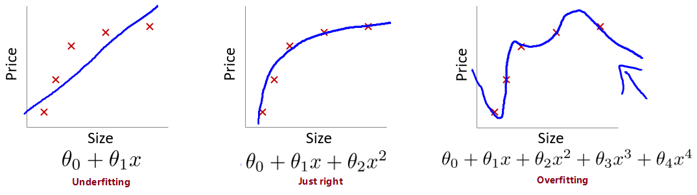

# 7 正则化（Regularization）
## 7.1 过拟合问题（The Problem of Overfitting）

对于拟合的表现，可以分为三类情况：
- **欠拟合（Underfitting）**

  无法很好的拟合训练集中的数据，预测值和实际值的误差很大，这类情况被称为欠拟合。拟合模型比较简单（特征选少了）时易出现这类情况。类似于，你上课不好好听，啥都不会，下课也差不多啥都不会。

- **优良的拟合（Just right）**

  不论是训练集数据还是不在训练集中的预测数据，都能给出较为正确的结果。类似于，学霸学神！

- **过拟合（Overfitting）**

  能很好甚至完美拟合训练集中的数据，即 $J(\theta) \to 0$，但是对于不在训练集中的**新数据**，预测值和实际值的误差会很大，**泛化能力弱**，这类情况被称为过拟合。拟合模型过于复杂（特征选多了）时易出现这类情况。类似于，你上课跟着老师做题都会都听懂了，下课遇到新题就懵了不会拓展。

线性模型中的拟合情况（左图欠拟合，右图过拟合）：



逻辑分类模型中的拟合情况：


为了度量拟合表现，引入：

- 偏差（bias）

  指模型的预测值与真实值的**偏离程度**。偏差越大，预测值偏离真实值越厉害。偏差低意味着能较好地反应训练集中的数据情况。

- 方差（Variance）

  指模型预测值的**离散程度或者变化范围**。方差越大，数据的分布越分散，函数波动越大，泛化能力越差。方差低意味着拟合曲线的稳定性高，波动小。

据此，我们有对同一数据的各类拟合情况如下图：


据上图，高偏差意味着欠拟合，高方差意味着过拟合。

我们应尽量使得拟合模型处于低方差（较好地拟合数据）状态且同时处于低偏差（较好地预测新值）的状态。

避免过拟合的方法有：

- 减少特征的数量
  - 手动选取需保留的特征
  - 使用模型选择算法来选取合适的特征（如 PCA 算法）
  - 减少特征的方式易丢失有用的特征信息
- 正则化（Regularization）
  - 可保留所有参数（许多有用的特征都能轻微影响结果）
  - 减少/惩罚各参数大小（magnitude），以减轻各参数对模型的影响程度
  - 当有很多参数对于模型只有轻微影响时，正则化方法的表现很好

## 7.2 代价函数（Cost Function）

很多时候由于特征数量过多，过拟合时我们很难选出要保留的特征，这时候应用正则化方法则是很好的选择。

上文中，$\theta_0 + \theta_1x + \theta_2x^2 + \theta_3x^3 + \theta_4x^4$ 这样一个复杂的多项式较易过拟合，在不减少特征的情况下，**如果能消除类似于 $\theta_3x^3$、$\theta_4x^4$ 等复杂部分，那复杂函数就变得简单了**。

为了保留各个参数的信息，不修改假设函数，改而修改代价函数：

$$
min_\theta\ \dfrac{1}{2m}\sum_{i=1}^m (h_\theta(x^{(i)}) - y^{(i)})^2 + 1000\cdot\theta_3^2 + 1000\cdot\theta_4^2
$$


上式中，我们在代价函数中增加了 $\theta_3$、$\theta_4$ 的惩罚项（penalty term）$1000\cdot\theta_3^2 + 1000\cdot\theta_4^2$，如果要最小化代价函数，那么势必需要极大地**减小 $\theta_3$、$\theta_4$**，从而使得假设函数中的 $\theta_3x^3$、$\theta_4x^4$ 这两项的参数非常小，就相当于没有了，假设函数也就**“变得”简单**了，从而在保留各参数的情况下避免了过拟合问题。


根据上面的讨论，有时也无法决定要减少哪个参数，故统一惩罚除了 $\theta_0$ 外的所有参数。

代价函数：

$$
J\left( \theta  \right)=\frac{1}{2m}[\sum\limits_{i=1}^{m}{{{({h_\theta}({{x}^{(i)}})-{{y}^{(i)}})}^{2}}+\lambda \sum\limits_{j=1}^{n}{\theta_{j}^{2}}]}
$$


> $\lambda$: 正则化参数（Regularization Parameter），$\lambda > 0$
>
> $\sum\limits_{j=1}^{n}$: 不惩罚基础参数 $\theta_0$
>
> $\lambda \sum\limits_{j=1}^{n}{\theta_{j}^{2}}$: 正则化项

$\lambda$ 正则化参数类似于学习速率，也需要我们自行对其选择一个合适的值。

- 过大
  - 导致模型欠拟合（假设可能会变成近乎 $x = \theta_0$ 的直线）
  - 无法正常去过拟问题
  - 梯度下降可能无法收敛
- 过小
  - 无法避免过拟合（等于没有）


> 正则化符合奥卡姆剃刀（Occam's razor）原理。在所有可能选择的模型中，能够很好地解释已知数据并且十分简单才是最好的模型，也就是应该选择的模型。从贝叶斯估计的角度来看，正则化项对应于模型的先验概率。可以假设复杂的模型有较大的先验概率，简单的模型有较小的先验概率。

> 正则化是结构风险最小化策略的实现，是去过拟合问题的典型方法，虽然看起来多了个一参数多了一重麻烦，后文会介绍自动选取正则化参数的方法。模型越复杂，正则化参数值就越大。比如，正则化项可以是模型参数向量的范数。

## 7.3 线性回归正则化（Regularized Linear Regression）

应用正则化的线性回归梯度下降算法：

$$
\begin{align*}
& \text{Repeat}\ \lbrace \\
& \ \ \ \ \theta_0 := \theta_0 - \alpha\ \frac{1}{m}\ \sum_{i=1}^m (h_\theta(x^{(i)}) - y^{(i)})x_0^{(i)} \\
& \ \ \ \ \theta_j := \theta_j - \alpha\ \left[ \left( \frac{1}{m}\ \sum_{i=1}^m (h_\theta(x^{(i)}) - y^{(i)})x_j^{(i)} \right) + \frac{\lambda}{m}\theta_j \right], \ \ \ j \in \lbrace 1,2...n\rbrace\\
& \rbrace
\end{align*}
$$
也可以移项得到更新表达式的另一种表示形式

$$
\theta_j := \theta_j(1 - \alpha\frac{\lambda}{m}) - \alpha\frac{1}{m}\sum_{i=1}^m(h_\theta(x^{(i)}) - y^{(i)})x_j^{(i)}
$$


> $\frac{\lambda}{m}\theta_j$: 正则化项


应用正则化的正规方程法[^2]：

$$
\begin{align*}
& \theta = \left( X^TX + \lambda \cdot L \right)^{-1} X^Ty \\
& \text{where}\ \ L = \begin{bmatrix} 0 & & & & \\
& 1 & & & \\
& & 1 & & \\
& & & \ddots & \\
& & & & 1 \\ \end{bmatrix}
\end{align*}
$$


> $\lambda\cdot L$: 正则化项
>
> $L$: 第一行第一列为 $0$ 的 $n+1$ 维单位矩阵

Octave 代码：
```matlab
>> L = eye(5)
>> L(1,1) = 0

L =

     0     0     0     0     0
     0     1     0     0     0
     0     0     1     0     0
     0     0     0     1     0
     0     0     0     0     1
```


前文提到正则化可以解决正规方程法中不可逆的问题，即增加了 $\lambda \cdot L$ 正则化项后，可以保证 $X^TX + \lambda \cdot L$ 可逆（invertible），即便 $X^TX$ 不可逆（non-invertible）。 

## 7.4 逻辑回归正则化（Regularized Logistic Regression）

为逻辑回归的代价函数添加正则化项：

$$
J(\theta) = - \frac{1}{m} \sum_{i=1}^m \large[ y^{(i)}\ \log (h_\theta (x^{(i)})) + (1 - y^{(i)})\ \log (1 - h_\theta(x^{(i)}))\large] + \frac{\lambda}{2m}\sum_{j=1}^n \theta_j^2
$$
前文已经证明过逻辑回归和线性回归的代价函数的求导结果是一样的，此处通过给正则化项添加常数 $\frac{1}{2}$，则其求导结果也就一样了。

从而有应用正则化的逻辑回归梯度下降算法：

$$
\begin{align*}
& \text{Repeat}\ \lbrace \\
& \ \ \ \ \theta_0 := \theta_0 - \alpha\ \frac{1}{m}\ \sum_{i=1}^m (h_\theta(x^{(i)}) - y^{(i)})x_0^{(i)} \\
& \ \ \ \ \theta_j := \theta_j - \alpha\ \left[ \left( \frac{1}{m}\ \sum_{i=1}^m (h_\theta(x^{(i)}) - y^{(i)})x_j^{(i)} \right) + \frac{\lambda}{m}\theta_j \right], \ \ \ j \in \lbrace 1,2...n\rbrace\\
& \rbrace \end{align*}
$$


[^1]: https://en.wikipedia.org/wiki/List_of_algorithms#Optimization_algorithms
[^2]: week2 - 4.6