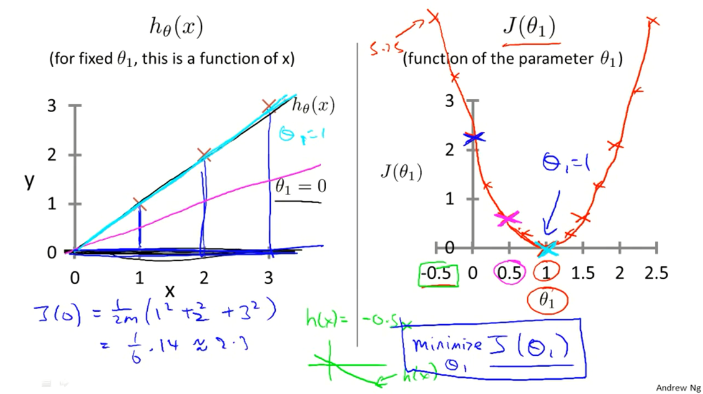
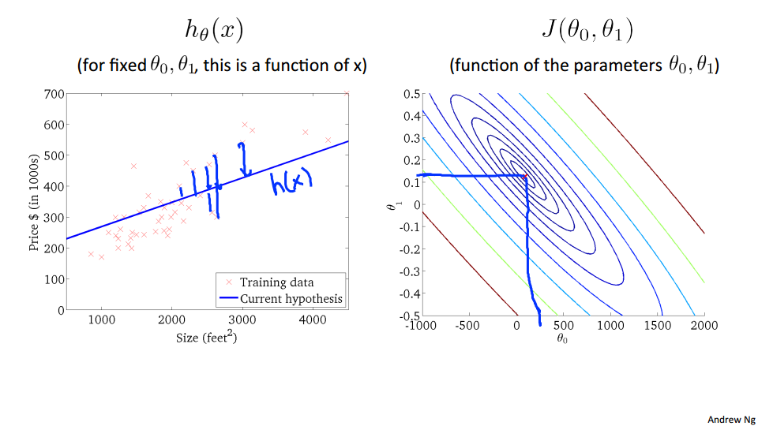
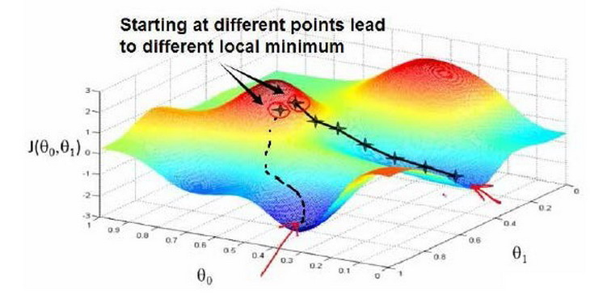
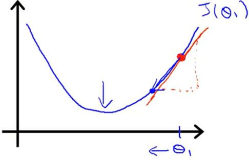
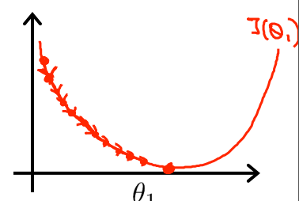

# 1. 引言(Introduction)

## 1.1 Welcome

随着互联网数据不断累积，硬件不断升级迭代，在这个信息爆炸的时代，机器学习已被应用在各行各业中，可谓无处不在。

一些常见的机器学习的应用，例如：

- 手写识别
- 垃圾邮件分类
- 搜索引擎
- 图像处理
- …

使用到机器学习的一些案例：

- 数据挖掘
  - 网页点击流数据分析
- 人工无法处理的工作(量大)
  - 手写识别
  - 计算机视觉
- 个人定制
  - 推荐系统
- 研究大脑

当然，还有更多其他的应用场景，总之，机器学习的出现让很多不可能成为了可能。

## 1.2 什么是机器学习(What is Machine Learning)
1. 机器学习定义
  这里主要有两种定义：

  - Arthur Samuel (1959). Machine Learning: Field of study that gives computers the ability to learn without being explicitly programmed.

    这个定义是非正式但是是最早的，来自于一个会计算机编程的下棋菜鸟，计算机通过不断的对弈，通过对弈计算布局的好坏，通过不断“学习”，积累经验，成为了一个厉害的棋手。

  - Tom Mitchell (1998) Well-posed Learning Problem: A computer program is said to learn from experience E with respect to some **task T** and some **performance measure P**, if its performance on T, as measured by P, improves with **experience E**. 

    此定义是**第一个正式的机器学习定义**，有点拗口，视频中介绍了一个例子，即垃圾邮件分类。对于垃圾邮件分类，文中的三个字母分别代表：

    - T(task): 对垃圾邮件分类这个任务。
    - P(Performance): 垃圾邮件分类的准确程度。
    - E(Experience): 用户对于邮件进行是否为垃圾邮件的分类（即帮助机器体验、学习）。

2. 机器学习算法

   主要有两种机器学习的算法分类

   1. 监督学习
   2. 无监督学习

   两者的区别为**是否需要人工参与数据标注**。这两部分的内容占比很大，并且很重要，掌握好了可以在以后的应用中节省大把大把的时间~

   还有一些算法也属于机器学习领域，诸如：

   - 半监督学习: 介于监督学习于无监督学习之间
   - 推荐算法: 没错，就是那些个买完之后还推荐同一款商品的某购物平台。
   - 强化学习: 通过观察来学习如何做出动作，每个动作都会对环境有所影响，而环境的反馈又可以引导该学习算法。
   - 迁移学习

## 1.3 监督学习(Supervised Learning)
监督学习，即为教计算机如何去完成预测任务（有反馈），预先给一定数据量的输入和对应的结果，建模拟合，最后让计算机预测未知数据的结果。

监督学习一般有两种：

1. 回归问题(Regression)

   回归问题即为预测一系列的**连续值**。

   在房屋价格预测的例子中，给出了一系列的房屋面基数据，根据这些数据来预测任意面积的房屋价格。

   

2. 分类问题(Classification)

   分类问题即为预测一系列的**离散值**。

   即根据数据预测被预测对象属于哪个分类。视频中举了癌症肿瘤这个例子，针对诊断结果，分别分类为良性或恶性。上个视频中的垃圾邮件分类问题，也同样属于监督学习中的分类问题。

   

视频中提到**支持向量机**这个算法，旨在解决当特征量很大的时候(特征即如癌症例子中的肿块大小，颜色，气味等各种特征)，计算机内存一定会不够用的情况。**支持向量机能让计算机处理无限多个特征。**

## 1.4 无监督学习(Unsupervised Learning)

相对于监督学习，训练集不会有人为标注的结果（无反馈），而是由计算机通过无监督学习算法来自行分析，计算机可能会把特定的数据集归为几个不同的簇，故叫做聚类算法。

无监督学习一般由两种：
1. 聚类(Clustering)
2. 关联(Associative)

这里列举一些无监督学习的例子：

- 新闻聚合分类
- DNA 个体聚类
- 社交网络
- 市场细分
- 天文数据分析

**例子，鸡尾酒问题**

在鸡尾酒会上，大家说话声音彼此重叠，几乎很难分辨出面前的人说了什么。我们很难对于这个问题进行数据标注，而这里的通过机器学习的无监督学习算法，就可以将说话者的声音同背景音乐分离出来，看视频，效果还不错呢\~~。

嗯，这块是打打鸡血的，只需要一行代码就解决了问题，就是这么简单！当然，我没复现过 ^_^……

神奇的一行代码：
`[W,s,v] = svd((repmat(sum(x.*x,1),size(x,1),1).*x)*x');`

在机器学习刚开始时，**推荐使用 Octave 类的工程计算软件**，因为在 C++ 或 Java 等编程语言中，编写对应的代码需要用到复杂的库以及要写大量的冗余代码，比较耗费时间，建议可以在学习过后再考虑使用其他语言来构建系统。****
另外，在做**原型搭建**的时候也应该先考虑使用类似于 Octave 这种便于计算的编程软件，当其已经可以工作后，才将模型移植到其他的高级编程语言中。

> 注：Octave 与 MATLAB 语法相近，由于 MATLAB 为商业软件，课程中使用开源且免费的 Octave。

机器学习领域的发展迅速，也可使用 Tensorflow 等开源机器学习框架学习，这些框架十分友好，易于编写及应用机器学习算法。

# 2 单变量线性回归(Linear Regression with One Variable)

## 2.1 模型表示(Model Representation)

1. 房价预测训练集

  | Size in $feet^2$ ($x$) | Price (\$) in 1000's($y$) |
  | ---------------------- | ------------------------- |
  | 2104                   | 460                       |
  | 1416                   | 232                       |
  | 1534                   | 315                       |
  | 852                    | 178                       |
  | ...                    | ...                       |

这个训练集中，既给出了输入 $x$ ，又给出了输出结果 $y$，即”正确结果“，预测的量是连续的，属于监督学习中的回归问题。

2. **问题解决模型**

：

其中 $h$ 代表结果函数，也称为**假设(hypothesis)** 。这个结果函数根据输入(房屋的面积)，给出预测结果输出(房屋的价格)。

$h_\theta(x)=\theta_0+\theta_1x$，为其中一种可行的表达式。

> $x$: 特征/输入变量。

上式中，$\theta$ 为参数，$\theta$ 的变化才决定了输出结果，不同以往，这里的 $x$ 被我们**视作已知**(不论是数据集还是预测前的输入)，所以怎样解得 $\theta$ 以拟合数据，成了求解该问题的最终问题。

单变量，即只有一个特征(如例子中房屋的面积这个特征)。

## 2.2 损失函数(Cost Function)

为了求解上个视频中提到的 $\theta$，本视频引入了损失函数(Cost Function)这个概念，损失函数，用于度量预测结果于实际结果的**建模误差**。

目的在于求解预测结果 $h_\theta(x)$  最接近于实际结果 $y$ 时 $\theta$ 的取值，则可以把问题转化为**求解 $\sum\limits_{i=0}^{m}(h_\theta(x^{(i)})-y^{(i)})$ 的最小值**。

> m: 训练集中的样本总数
>
> y: 目标变量/输出变量
>
> $\left(x, y\right)$: 训练集中的实例
>
> $\left(x^\left(i\right), y^\left(i\right)\right)$: 训练集中的第 $i$ 个样本实例

上图中，为在 $\theta$ 取不同值时的拟合情况，蓝色虚线代表的即为误差，要最小化的就是每个预测点的误差值。

这里则要引入损失函数的概念，我们对求最小值的式子进行数学建模，让其变得易于求最小值，而其中一种办法就是建模为二次函数，即统计学上的平方损失函数（最小二乘法）：

$$ J\left( \theta  \right)=\frac{1}{2m}\sum\limits_{i=1}^{m}{{{\left( {{h}_{\theta }}\left( {{x}^{(i)}} \right)-{{y}^{(i)}} \right)}^{2}}} $$ 

> 系数 $\frac{1}{2}$ 存在与否都不会影响结果，这里是为了在应用梯度下降时便于求解。

对于之前的房价问题来说，我们的问题就转化成了**求解 $J\left( \theta_0, \theta_1  \right)$ 的最小值**。

## 2.3 损失函数 - 直观理解1(Cost Function - Intuition I)

根据上节视频，列出如下定义：

- 假设函数(Hypothesis): $h_\theta(x)=\theta_0+\theta_1x$
- 参数(Parameters): $\theta_0, \theta_1$
- 损失函数(Cost Function): $ J\left( \theta_0, \theta_1  \right)=\frac{1}{2m}\sum\limits_{i=1}^{m}{{{\left( {{h}_{\theta }}\left( {{x}^{(i)}} \right)-{{y}^{(i)}} \right)}^{2}}} $
- 目标(Goal): $\underset{\theta_0, \theta_1}{\text{minimize}} J \left(\theta_0, \theta_1 \right)$

为了直观的理解损失函数到底是在做什么，先假设 $\theta_1 = 0$，并假设训练集有三个数据，分别为$\left(1, 1\right), \left(2, 2\right), \left(3, 3\right)$。

<!-->TODO: 可更换为动图<-->

上图显示了 $J\left(\theta_0, \theta_1\right)$ 随着 $\theta_1$ 的变化而变化，**当 $\theta_1 = 1$ 时，$J\left(\theta_0, \theta_1 \right) = 0$，取得最小值。**

## 2.4 损失函数 - 直观理解2(Cost Function - Intuition II)

> 注：该部分由于涉及到了多变量成像，可能较难理解，要求只需要理解上节内容即可，该节如果不能较好理解也可跳过。

数据集：

下图是在该数据集中，平方损失函数在 $\theta_0 \neq  0$ 时绘制出的3-D图像，空间的高度则为 $J\left(\theta\right)$ 的值。

由于3-D图形不便于标注，所以将3-D图形转换为**轮廓图(contour plot)**，下面用轮廓图来作直观理解，即下图中的右图。

轮廓图中，相同颜色的一圈代表同一高度（同一 $J\left(\theta\right)$ 值），最中心的部分，即红点的部分，就是这个损失函数的最小值，对应的 $h_\theta\left(x\right)$ 以及对数据的拟合情况就是左图啦，嗯，一看就拟合的很不错，预测应该比较精准啦

## 2.5 梯度下降(Gradient Descent)

由于数据量、特征量会随着数据集的增长而越来越大，即便是借用计算机来生成图像，人工的方法也无法读出 $J\left(\theta\right)$ 的最小值，并且大多数情况无法进行可视化，所以引入**梯度下降(Gradient Descent)，让计算机自动找出 $\theta$ 值，最小化损失函数。**

梯度下降背后的思想是：开始时，我们随机选择一个参数组合$\left( {\theta_{0}},{\theta_{1}},......,{\theta_{n}} \right)$即起始点，计算损失函数，然后寻找下一个能使得损失函数下降最多的参数组合。不断迭代，直到找到一个**局部最小值(local minimum)**，由于下降的情况只考虑当前参数组合周围的情况，所以无法确定当前的局部最小值是否就是**全局最小值(global minimum)**，不同的初始参数组合，可能会产生不同的局部最小值。

下图根据不同的起始点，产生了两个不同的局部最小值。

视频中举了下山的例子，即我们在山顶上的某个位置，为了下山，就不断地看一下周围**下一步往哪走**下山比较快，然后就**迈出那一步**，一直重复，直到我们到达某一块山下的**陆地**。

先给出梯度下降的公式：
$$
{{\theta }_{j}}:={{\theta }_{j}}-\alpha \frac{\partial }{\partial {{\theta }_{j}}}J\left( \theta_0, \theta_1  \right)
$$

> ${\theta }_{j}$: 第 $j$ 个特征参数
>
> ”:=“: 赋值操作符
>
> $\alpha$: 学习速率(learning rate), $\alpha > 0$
>
> $\frac{\partial }{\partial {{\theta }_{j}}}J\left( \theta_0, \theta_1  \right)$: $J\left( \theta_0, \theta_1 \right)$ 的偏导

学习速率决定了参数值变化的速率即”**走多少距离**“，而偏导这部分决定了下降的方向即”**下一步往哪里**“走（当然实际上的走多少距离是由偏导值给出的，学习速率起到调整后决定的作用），收敛处的局部最小值又叫做极小值，即”**陆地**“。

这里非常重要的一个点是，在计算时**要批量更新 $\theta$ 值**，否则结果上会有所出入，原因不做细究。

## 2.6 梯度下降直观理解(Gradient Descent Intuition)

该节探讨 $\theta_1$ 的梯度下降更新过程，即 $\theta_1 := \theta_1 - \alpha\frac{d}{d\theta_1}J\left(\theta_1\right)$，注意到这里为了数学定义上的精确性，是 $\frac{d}{d\theta_1}J\left(\theta_1\right)$，如果不熟悉微积分学，就把它视作之前的 $\frac{\partial}{\partial\theta}$ 即可。

把红点定为初始点，切于初始点的红色直线的斜率，代表 $J\left(\theta\right)$ 在初始点处有**正斜率**，也就是说它有**正导数**，则 $\theta_1$ 等于 初始值 - 学习速率 * 导数，即 $\theta_1$ 会**向左边移动**。这样不断重复，直到收敛（达到局部最小值，即斜率为0，所以如果 $\theta$ 值已经在极小值点处时，梯度下降算法将什么也不做）。

> 不熟悉斜率的话，可以理解为斜率的值等于图中三角形的高度除以水平长度，精确地求斜率的方法是求导。

对于学习速率 $\alpha$ ，需要选取一个合适的值才可以收敛。

- 学习速率过小：

  

  收敛的太慢，需要更多次的迭代。

- 学习速率过大：

  

  可能越过最低点，甚至导致无法收敛。

学习速率只需选定即可，不需要在运行梯度下降算法的时候进行动态改变，因为由于斜率的变化（越来越接近于0），损失函数的变化幅度会越来越小，直到收敛到局部极小值。

如图，品红色点为初始点，损失函数随着迭代的进行，变化的幅度越来越小。

梯度下降不止可以用于线性回归中的损失函数，还通用于最小化其他的损失函数。

## 2.7 线性回归中的梯度下降(Gradient Descent For Linear Regression)

将线性回归模型和梯度下降算法结合，则可得出单变量线性问题的解。

- $h_\theta(x)=\theta_0+\theta_1x$
- $ J\left( \theta_0, \theta_1  \right)=\frac{1}{2m}\sum\limits_{i=1}^{m}{{{\left( {{h}_{\theta }}\left( {{x}^{(i)}} \right)-{{y}^{(i)}} \right)}^{2}}} $
- ${{\theta }_{j}}:={{\theta }_{j}}-\alpha \frac{\partial }{\partial {{\theta }_{j}}}J\left( \theta_0, \theta_1 \right)$

这里将线性回归模型公式直接带入梯度下降公式即可得出公式：

其实上文中提到的梯度下降，都为批量梯度下降(Batch Gradient Descent)，即每次计算都使用所有的数据集 $\left(\sum\limits_{i=1}^{m}\right)$ 更新。

视频中直接给出了 $j = 0, j = 1$ 时求解偏导的计算方法，这里给出推导过程如下：

$\frac{\partial}{\partial\theta_j} J(\theta_1, \theta_2)=\frac{\partial}{\partial\theta_j} \left(\frac{1}{2m}\sum\limits_{i=1}^{m}{{\left( {{h}_{\theta }}\left( {{x}^{(i)}} \right)-{{y}^{(i)}} \right)}^{2}} \right)=$

$\left(\frac{1}{2m}*2\sum\limits_{i=1}^{m}{{\left( {{h}_{\theta }}\left( {{x}^{(i)}} \right)-{{y}^{(i)}} \right)}} \right)*\frac{\partial}{\partial\theta_j}{{\left( {{h}_{\theta }}\left( {{x}^{(i)}} \right)-{{y}^{(i)}} \right)}} =$

$\left(\frac{1}{m}\sum\limits_{i=1}^{m}{{\left( {{h}_{\theta }}\left( {{x}^{(i)}} \right)-{{y}^{(i)}} \right)}} \right)*\frac{\partial}{\partial\theta_j}{{\left(\theta_0{x_0^{(i)}} + \theta_1{x_1^{(i)}}-{{y}^{(i)}} \right)}}$

所以当 $j = 0$ 时：

$\frac{\partial}{\partial\theta_0} J(\theta)=\frac{1}{m}\sum\limits_{i=1}^{m}{{\left( {{h}_{\theta }}\left( {{x}^{(i)}} \right)-{{y}^{(i)}} \right)}} *x_0^{(i)}$

所以当 $j = 1$ 时：

$\frac{\partial}{\partial\theta_1} J(\theta)=\frac{1}{m}\sum\limits_{i=1}^{m}{{\left( {{h}_{\theta }}\left( {{x}^{(i)}} \right)-{{y}^{(i)}} \right)}} *x_1^{(i)}$

使用循环代码较为冗余，后面会讲到如何使用**向量化(Vectorization)**来简化代码并优化计算，使得梯度下降运行的更快。

# 3 Linear Algebra Review

这部分，学过线性代数的可以复习一下，比较基础。笔记整理暂留。

## 3.1 Matrices and Vectors

## 3.2 Addition and Scalar Multiplication

## 3.3 Matrix Vector Multiplication

## 3.4 Matrix Matrix Multiplication

## 3.5 Matrix Multiplication Properties

## 3.6 Inverse and Transpose

