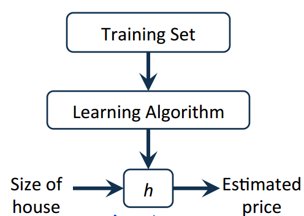

# 1. 引言(Introduction)

## 1.1 Welcome

由于目前网络中数据的爆炸性增长，以及目前硬件方面升级迭代，机器学习的很多算法再次被开发，并进行了实际的工业使用。

第一个视频介绍了一些机器学习的应用，例如：

- 手写识别
- 垃圾邮件分类
- 搜索引擎
- 照片处理
- …

使用到机器学习的一些案例：

- 数据挖掘
  - 网页访问记录
- 人工无法处理的工作
  - 手写识别
  - 计算机视觉
- 个人定制
  - 推荐系统
- 研究大脑

总之就是，机器学习的出现让很多不可能成为了可能，让许多可能变得更好。

## 1.2 什么是机器学习(What is Machine Learning)
1. 机器学习定义
  这里主要有两种定义：

  - Arthur Samuel (1959). Machine Learning: Field of study that gives computers the ability to learn without being explicitly programmed.

    这个定义是非正式但是是最早的，来自于一个会计算机编程的下棋菜鸟，计算机通过不断的对弈，通过对弈计算布局的好坏，通过不断“学习”，积累经验，成为了一个厉害的棋手。

  - Tom Mitchell (1998) Well-posed Learning Problem: A computer program is said to learn from experience E with respect to some task T and some performance measure P, if its performance on T, as measured by P, improves with experience E. 

    这个定义是第一个正式的机器学习定义，有点拗口，视频介绍了一个例子，即垃圾邮件分类的例子，对于垃圾邮件分类，三个字母分别代表：

    - T(task): 对垃圾邮件分类这个任务。
    - P(Performance): 垃圾邮件分类的准确程度。
    - E(Experience): 用户对于邮件进行是否为垃圾邮件的分类（即帮助机器体验、学习）。

2. 机器学习算法

   主要有两种机器学习的算法分类

   1. 监督学习
   2. 无监督学习

   两者的区别为**是否需要人工参与数据标注**。这两部分的内容占比很大，并且很重要，掌握的不好很容易在实际的运用中浪费大量的时间。

   还有一些算法也属于机器学习领域，诸如：

   - 半监督学习
   - 推荐算法
   - 强化学习：通过观察来学习如何做出动作，每个动作都会对环境有所影响，而环境的反馈又可以引导该学习算法。
   - 迁移学习

## 1.3 监督学习(Supervised Learning)
监督学习，即为教计算机如何去完成预测任务（有反馈），预先给一定数据量的输入和对应的结果，建模拟合，最后让计算机进行预测未知数据的结果。

监督学习一般有两种：

1. 回归问题(Regression)

   回归问题即为预测一系列的**连续值**。

   视频中举了房屋价格预测的例子，即给出了一系列的房屋数据，根据其预测任意给定数据的房屋价格。

   

2. 分类问题(Classification)

   分类问题即为预测一系列的**离散值**。

   即根据数据预测被预测对象属于哪个分类。视频中举了癌症肿瘤这个例子，分类分为良性和恶性。上个视频中的垃圾邮件分类问题，也同样是监督学习中的分类问题。

   

视频中提到**支持向量机**这个算法，当特征量很大的时候(特征即如癌症例子中的肿块大小，颜色，气味等各种特征)，计算机内存一定会不够用，支持向量机则能用于大量特征值，能让计算机处理无限多个特征。

## 1.4 无监督学习(Unsupervised Learning)

相对于监督学习，训练集不会有人为标注的结果（无反馈），而是由计算机通过无监督学习算法来自行分析，计算机可能会把特定的数据集归为几个不同的簇，故叫做聚类算法。

无监督学习一般由两种：
1. 聚类(Clustering)
2. 关联(Associative)

这里列举一些无监督学习的例子：

- 新闻聚合分类
- DNA 个体聚类
- 社交网络
- 市场细分
- 天文数据分析

**鸡尾酒问题**

在鸡尾酒会上，大家说话声音彼此重叠，几乎很难分辨出面前的人说了什么。而这里的机器学习鸡尾酒算法就可以将说话者的声音同背景音乐分离出来，效果还不错呢\~~。

嗯，这块是打打鸡血的，只需要一行代码，就是这么简单！嗯，当然，我没复现过 ^_^。

神奇的代码：
`[W,s,v] = svd((repmat(sum(x.*x,1),size(x,1),1).*x)*x');`

提到了在机器学习刚开始时，**推荐使用 Matlab 类的工程编程语言**，因为在 C++ 或 Java 等编程语言中，编写对应的代码需要用到复杂的库以及大量的冗余代码，比较耗费时间，建议可以在学习过后再考虑使用其他语言来构建系统。**（其实 tensorflow 的代码也非常简单，尚可一试。）**
另外，尤其是在做**原型搭建**的时候，也仍然使用 Octave，当其已经可以工作后，才将模型移植到其他的高级编程语言中。

# 2 单变量线性回归(Linear Regression with One Variable)

## 2.1 模型表示(Model Representation)

1. 房价预测训练集

  | Size in $feet^2$ ($x$) | Price (\$) in 1000's($y$) |
  | ---------------------- | ------------------------- |
  | 2104                   | 460                       |
  | 1416                   | 232                       |
  | 1534                   | 315                       |
  | 852                    | 178                       |
  | ...                    | ...                       |

这个训练集中，既给出了输入 $x$ ，又给出了输出结果 $y$，即”正确结果“，预测的量是连续的，属于监督学习中的回归问题。

**下图解决了这个回归问题：**

：

其中 $h$ 代表结果函数，也称为**假设(hypothesis)** 。这个结果函数根据输入(即房屋的面积大，给出预测结果输出(即房屋的价格)。

$h_\theta(x)=\theta_0+\theta_1x$，为其中一种可行的表达式。

上式中，$\theta$ 为参数，$\theta$ 的变化决定了输出结果，不同以往，这里的 $x$ 被我们**视作已知**（即不论是数据集还是预测前的输入），所以怎样解得 $\theta$ 以拟合数据，成了求解该问题的最终问题。

单变量即只有一个特征(房屋的面积)

## 2.2 损失函数(Cost Function)

为了求解上个视频中提到的 $\theta$，本视频引入了损失函数(Cost Function)这个概念，损失函数，用于度量预测结果于实际结果的**建模误差**。

目的在于求解预测结果 $h_\theta(x)$  最接近于实际结果 $y$ 时 $\theta$ 的取值，则可以把问题转化为**求解 $\sum\limits_{i=0}^{n}(h_\theta(x^{(i)})-y^{(i)})$ 的最小值**。

上图中，为在 $\theta$ 取不同值时的拟合情况，蓝色虚线代表的即为误差，要最小化的就是每个预测点的误差值。

这里则要引入损失函数的概念，我们对求最小值的式子进行数学建模，让其变得易于求最小值，而其中一种办法就是建模为二次函数，即统计学上的平方损失函数（最小二乘法）：

$$ J\left( \theta  \right)=\frac{1}{2m}\sum\limits_{i=1}^{m}{{{\left( {{h}_{\theta }}\left( {{x}^{(i)}} \right)-{{y}^{(i)}} \right)}^{2}}} $$ ，其中 $m$ 为训练集中的样本数量。

对于之前的房价问题来说，我们的问题就转化成了**求解 $J\left( \theta_0, \theta_1  \right)$ 的最小值**。

## 2.3 Cost Function - Intuition I

## 2.4 Cost Function - Intuition II

## 2.5 Gradient Descent

## 2.6 Gradient Descent Intuition

## 2.7 Gradient Descent For Linear Regression

# 3 Linear Algebra Review

## 3.1 Matrices and Vectors

## 3.2 Addition and Scalar Multiplication

## 3.3 Matrix Vector Multiplication

## 3.4 Matrix Matrix Multiplication

## 3.5 Matrix Multiplication Properties

## 3.6 Inverse and Transpose

