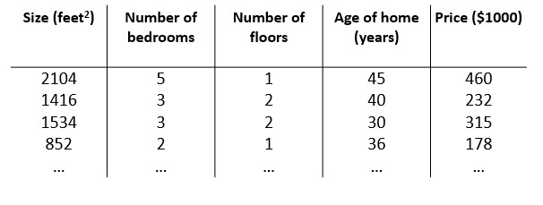
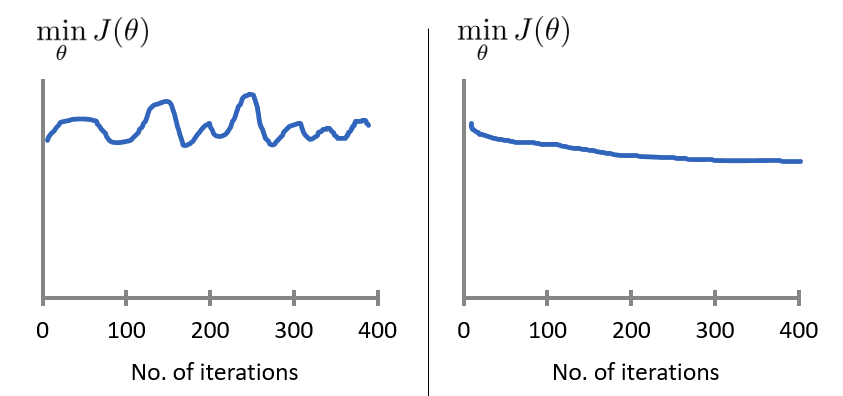

[TOC]

# 4 多变量线性回归(Linear Regression with Multiple Variables)

## 4.1 多特征(Multiple Features)

对于一个要度量的对象，一般来说会有不同维度的多个特征。比如之前的房屋价格预测例子中，除了房屋的面积大小，可能还有房屋的年限、房屋的层数等等其他特征：

这里由于特征不再只有一个，引入一些新的记号

> $n$: 特征的总数 
>
>  ${x}^{\left( i \right)}$: 代表特征矩阵中第 $i$ 行，也就是第 $i$ 个训练实例。
>
>  ${x}_{j}^{\left( i \right)}$: 代表特征矩阵中第 $i$ 行的第 $j$ 个特征，也就是第 $i$ 个训练实例的第 $j$ 个特征。

参照上图，则有 ${x}^{(2)}\text{=}\begin{bmatrix} 1416\\\ 3\\\ 2\\\ 40 \end{bmatrix}, {x}^{(2)}_{1} = 1416$

多变量假设函数 $h$ 表示为：$h_{\theta}\left( x \right)={\theta_{0}}+{\theta_{1}}{x_{1}}+{\theta_{2}}{x_{2}}+...+{\theta_{n}}{x_{n}}$

对于 $\theta_0$，和单特征中一样，我们将其看作基础数值。例如，房价的基础价格。

参数向量的维度为 $n+1$，在特征向量中添加 $x_{0}$ 后，其维度也变为 $n+1$， 则运用线性代数，可对 $h$ 简化。 

$h_\theta\left(x\right)=\begin{bmatrix}\theta_0\; \theta_1\; ... \;\theta_n \end{bmatrix}\begin{bmatrix}x_0 \newline x_1 \newline \vdots \newline x_n\end{bmatrix}= \theta^T x$

> $\theta^T$: $\theta$ 矩阵的转置
>
> $x_0$: 为了计算方便我们会假设 $x_0^{(i)} = 1$

## 4.2 多变量梯度下降(Gradient Descent for Multiple Variables)

多变量损失函数类似于单变量损失函数，

即 $J\left( {\theta_{0}},{\theta_{1}}...{\theta_{n}} \right)=\frac{1}{2m}\sum\limits_{i=1}^{m}{{{\left( h_{\theta} \left({x}^{\left( i \right)} \right)-{y}^{\left( i \right)} \right)}^{2}}}$ ，其中 $h_\theta\left(x\right)= \theta^T x$。

前文提到梯度下降对于最小化损失函数的通用性，则多变量梯度下降公式即

$\begin{align*} & \text{repeat until convergence:} \; \lbrace \newline \; &{{\theta }_{j}}:={{\theta }_{j}}-\alpha \frac{\partial }{\partial {{\theta }_{j}}}J\left( {\theta_{0}},{\theta_{1}}...{\theta_{n}}  \right) \newline \rbrace \end{align*}​$

对其求导：

$\begin{align*}& \text{repeat until convergence:} \; \lbrace \newline \; & \theta_j := \theta_j - \alpha \frac{1}{m} \sum\limits_{i=1}^{m} (h_\theta(x^{(i)}) - y^{(i)}) \cdot x_j^{(i)} \; & \text{for j := 0,1...n}\newline \rbrace\end{align*}$

可展开为：

$\begin{align*} & \text{repeat until convergence:} \; \lbrace \newline \; & \theta_0 := \theta_0 - \alpha \frac{1}{m} \sum\limits_{i=1}^{m} (h_\theta(x^{(i)}) - y^{(i)}) \cdot x_0^{(i)}\newline \; & \theta_1 := \theta_1 - \alpha \frac{1}{m} \sum\limits_{i=1}^{m} (h_\theta(x^{(i)}) - y^{(i)}) \cdot x_1^{(i)} \newline \; & \theta_2 := \theta_2 - \alpha \frac{1}{m} \sum\limits_{i=1}^{m} (h_\theta(x^{(i)}) - y^{(i)}) \cdot x_2^{(i)} \newline & \vdots \newline \; & \theta_n := \theta_n - \alpha \frac{1}{m} \sum\limits_{i=1}^{m} (h_\theta(x^{(i)}) - y^{(i)}) \cdot x_n^{(i)} &\newline \rbrace \end{align*}$

当然，同单变量梯度下降一样，计算时需要**同时更新**所有参数。

## 4.3 梯度下降实践1-特征值缩放(Gradient Descent in Practice I - Feature Scaling)

在应用梯度下降算法实践时，由于各特征值的范围不一，可能会导致损失函数收敛过慢。

以房价预测问题为例，这里选取房屋面积大小和房间数量这两个特征。

下图中，左图是以原始数据绘制的损失函数轮廓图，右图为采用特征缩放（都除以最大值）后图像。左图中呈现的图像较扁，相对于使用特征缩放方法的右图，梯度下降算法需要更多次的迭代。

为了优化梯度下降的收敛速度，采用特征缩放方法，使各特征值的**范围尽量一致**。

除了以上图人工选择并除以一个参数的方式，**均值归一化(Mean normalization)**方法更为便捷，可采用它来对所有特征值统一缩放：

 $x_i=\frac{x_i-average(x)}{maximum(x)-minimum(x)}, 使得 $ $x_i \in (-1,1)$$

对于特征的范围，并不一定需要使得 $-1 < x < 1$，类似于 $1\leqslant x \leqslant 3$ 也是可取的。

另外注意，一旦采用特征缩放，我们就需对所有的输入采用特征缩放，包括训练集、测试集、预测输入等。

## 4.4 梯度下降实践2-学习速率(Gradient Descent in Practice II - Learning Rate)

对于梯度下降，一般给定迭代次数来得出最小化损失函数的参数值，当然也可以设定比如 $J\left(\theta\right) < {10}^{-3}$ 等下限值来得到参数值，不过我们更常用的是**给定迭代次数**来得到参数值。

通过绘制损失函数关于迭代次数的图像，我们可以可视化梯度下降的执行过程，直观的图形可以帮助我们发现损失函数趋向于多少时能趋于收敛，参考图像来调整诸如学习速率的取值，迭代次数的选定等问题。

对于学习速率 $\alpha$，一般上图为合适，下图中左图可能表明 **$\alpha$ 过大**，损失函数**无法收敛**，右图可能表明 **$\alpha$ 过小**，损失函数**收敛的太慢**。当然，$\alpha$ 足够小时，损失函数在每轮迭代后一定会减少。$\alpha$ 可选取如 $\dots\;0,001,\;0.003,\;0.01,\;0.03,\;0.1,\;\dots$

另外，迭代次数刚开始可尽量高些，后面再根据需要同 $\alpha$ 进行调整。

## 4.5 特征和多项式回归(Features and Polynomial Regression)

线性回归只能以直线来对数据进行拟合，有时候需要使用曲线来对数据进行拟合，即多项式回归(Polynomial Regression)。

比如一个二次方模型：$h_{\theta}\left( x \right)={\theta_{0}}+{\theta_{1}}{x_{1}}+{\theta_{2}}{x_{2}^2}$

或者三次方模型：$h_{\theta}\left( x \right)={\theta_{0}}+{\theta_{1}}{x_{1}}+{\theta_{2}}{x_{2}^2}+{\theta_{3}}{x_{3}^3}$ 

或者平方根模型： $h_{\theta}\left( x \right)={\theta_{0}}+{\theta_{1}}{x_{1}}+{\theta_{2}}{x_{2}^2}+{\theta_{3}}{\sqrt{x_3}}$

在使用多项式回归时，要记住非常有必要进行特征缩放。

## 4.6 Normal Equation

## 4.7 Normal Equation Noninvertibility

# 5 Octave Matlab Tutorial

复习时可直接倍速回顾视频，笔记整理暂留。

## 5.1 Basic Operations

## 5.2 Moving Data Around

## 5.3 Computing on Data

## 5.4 Plotting Data

## 5.5 Control Statements_ for, while, if statement

## 5.6 Vectorization

## 5.x 常用函数整理