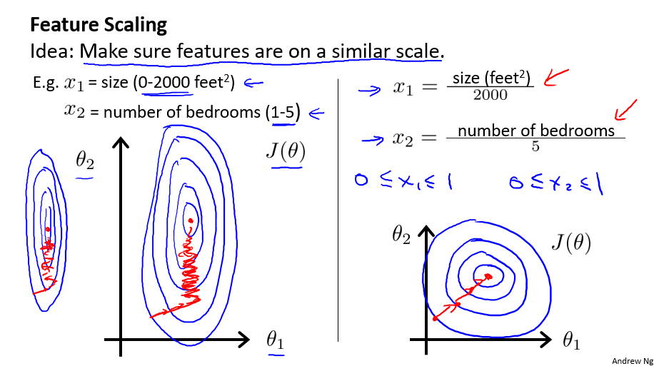

# 4 多变量线性回归（Linear Regression with Multiple Variables）

## 4.1 多特征（Multiple Features）

对于一个要度量的对象，一般来说会有不同维度的多个特征。比如之前的房屋价格预测例子中，除了房屋的面积大小，可能还有房屋的年限、房屋的层数等等其他特征：

这里由于特征不再只有一个，引入一些新的记号

> $n$: 特征的总数
>
>  ${x}^{\left( i \right)}$: 代表样本矩阵中第 $i$ 行，也就是第 $i$ 个训练实例。
>
>  ${x}_{j}^{\left( i \right)}$: 代表样本矩阵中第 $i$ 行的第 $j$ 列，也就是第 $i$ 个训练实例的第 $j$ 个特征。

参照上图，则有 ${x}^{(2)}\text{=}\begin{bmatrix} 1416\\\ 3\\\ 2\\\ 40 \end{bmatrix}, {x}^{(2)}_{1} = 1416$

多变量假设函数 $h$ 表示为：$h_{\theta}\left( x \right)={\theta_{0}}+{\theta_{1}}{x_{1}}+{\theta_{2}}{x_{2}}+...+{\theta_{n}}{x_{n}}$

对于 $\theta_0$，和单特征中一样，我们将其看作基础数值。例如，房价的基础价格。

参数向量的维度为 $n+1$，在特征向量中添加 $x_{0}$ 后，其维度也变为 $n+1$， 则运用线性代数，可简化 $h$：

$$
h_\theta\left(x\right)=\begin{bmatrix}\theta_0\; \theta_1\; ... \;\theta_n \end{bmatrix}\begin{bmatrix}x_0 \newline x_1 \newline \vdots \newline x_n\end{bmatrix}= \theta^T x
$$

> $\theta^T$: $\theta$ 矩阵的转置
>
> $x$: 某个样本的特征向量，$n+1$ 维特征量向量
>
> $x_0$: 为了计算方便我们会假设 $x_0^{(i)} = 1$

**注：该部分记号较多，记不住可随时回顾！**

## 4.2 多变量梯度下降（Gradient Descent for Multiple Variables）

多变量代价函数类似于单变量代价函数，

即 $J\left( {\theta_{0}},{\theta_{1}}...{\theta_{n}} \right)=\frac{1}{2m}\sum\limits_{i=1}^{m}{{{\left( h_{\theta} \left({x}^{\left( i \right)} \right)-{y}^{\left( i \right)} \right)}^{2}}}$ ，其中 $h_\theta\left(x\right)= \theta^T x$。

前文提到梯度下降对于最小化代价函数的通用性，则多变量梯度下降公式即

$$
\begin{align*}
& \text{Repeat until convergence:} \; \lbrace \\
&{{\theta }_{j}}:={{\theta }_{j}}-\alpha \frac{\partial }{\partial {{\theta }_{j}}}J\left( {\theta_{0}},{\theta_{1}}...{\theta_{n}}  \right) \\
\rbrace
\end{align*}
$$

解出偏导得：

$$
\begin{align*}
& \text{repeat until convergence:} \; \lbrace \\
& \theta_j := \theta_j - \alpha \frac{1}{m} \sum\limits_{i=1}^{m} (h_\theta(x^{(i)}) - y^{(i)}) \cdot x_j^{(i)} \; & \text{for j := 0,1...n}\\
\rbrace
\end{align*}
$$

可展开为：

$$
\begin{aligned}
& \text{repeat until convergence:} \; \lbrace \\
& \theta_0 := \theta_0 - \alpha \frac{1}{m} \sum\limits_{i=1}^{m} (h_\theta(x^{(i)}) - y^{(i)}) \cdot x_0^{(i)}\\
& \theta_1 := \theta_1 - \alpha \frac{1}{m} \sum\limits_{i=1}^{m} (h_\theta(x^{(i)}) - y^{(i)}) \cdot x_1^{(i)} \\
& \theta_2 := \theta_2 - \alpha \frac{1}{m} \sum\limits_{i=1}^{m} (h_\theta(x^{(i)}) - y^{(i)}) \cdot x_2^{(i)} \\
& \vdots \\
& \theta_n := \theta_n - \alpha \frac{1}{m} \sum\limits_{i=1}^{m} (h_\theta(x^{(i)}) - y^{(i)}) \cdot x_n^{(i)} &\\
\rbrace
\end{aligned}
$$

当然，同单变量梯度下降一样，计算时需要**同时更新**所有参数。

$h_\theta\left(x\right)= \theta^T x$，则得到同时更新参数的向量化（Vectorization）实现：
$$
\theta = \theta - \alpha \frac{1}{m}(X^T(X\theta-y))
$$

> $X$: 训练集数据，$m\times(n+1)$ 维矩阵（包含基本特征 $x_0=1$）

## 4.3 梯度下降实践1-特征值缩放（Gradient Descent in Practice I - Feature Scaling）

在应用梯度下降算法实践时，由于各特征值的范围不一，可能会影响代价函数收敛速度。

以房价预测问题为例，这里选取房屋面积大小和房间数量这两个特征。

下图中，左图是以原始数据绘制的代价函数轮廓图，右图为采用特征缩放（都除以最大值）后图像。左图中呈现的图像较扁，相对于使用特征缩放方法的右图，梯度下降算法需要更多次的迭代。

为了优化梯度下降的收敛速度，采用特征缩放的技巧，使各特征值的**范围尽量一致**。

除了以上图人工选择并除以一个参数的方式，**均值归一化（Mean normalization）**方法更为便捷，可采用它来对所有特征值统一缩放：

 $x_i:=\frac{x_i-average(x)}{maximum(x)-minimum(x)}$, 使得  $x_i \in (-1,1)$

对于特征的范围，并不一定需要使得 $-1 \leqslant x \leqslant 1$，类似于 $1\leqslant x \leqslant 3$ 等也是可取的，而诸如 $-100 \leqslant x \leqslant 100 $，$-0.00001 \leqslant x \leqslant 0.00001$，就显得过大/过小了。

另外注意，一旦采用特征缩放，我们就需对所有的输入采用特征缩放，包括训练集、测试集、预测输入等。

## 4.4 梯度下降实践2-学习速率（Gradient Descent in Practice II - Learning Rate）

通常，有两种方法来确定函数是否收敛

- 多次迭代收敛法
  - 无法确定需要多少次迭代
  - 较易绘制关于迭代次数的图像
  - 根据图像易预测所需的迭代次数
- 自动化测试收敛法（比较阈值）
  - 不易选取阈值
  - 代价函数近乎直线时无法确定收敛情况

对于梯度下降，一般采用多次迭代收敛法来得出最小化代价函数的参数值，自动化测试收敛法（如设定 $J\left(\theta\right) < {10}^{-3}$ 时判定收敛）则几乎不会被使用。

我们可以通过绘制**代价函数关于迭代次数的图像**，可视化梯度下降的执行过程，借助直观的图形来发现代价函数趋向于多少时能趋于收敛，依据图像变化情况，确定诸如学习速率的取值，迭代次数的大小等问题。

对于学习速率 $\alpha$，一般上图展现的为适中情况，下图中，左图可能表明 **$\alpha$ 过大**，代价函数**无法收敛**，右图可能表明 **$\alpha$ 过小**，代价函数**收敛的太慢**。当然，$\alpha$ 足够小时，代价函数在每轮迭代后一定会减少。

通过不断改变 $\alpha$ 值，绘制并观察图像，并以此来确定合适的学习速率。 尝试时可取 $\alpha$ 如 $\dots\;0,001,\;0.003,\;0.01,\;0.03,\;0.1,\;\dots$

## 4.5 特征和多项式回归（Features and Polynomial Regression）

在特征选取时，我们也可以自己归纳总结，定义一个新的特征，用来**取代或拆分**旧的一个或多个特征。比如，对于房屋面积特征来说，我们可以将其拆分为长度和宽度两个特征，反之，我们也可以合并长度和宽度这两个特征为面积这一个特征。

线性回归只能以直线来对数据进行拟合，有时候需要使用**曲线**来对数据进行拟合，即**多项式回归（Polynomial Regression）**。

比如一个二次方模型：$h_{\theta}\left( x \right)={\theta_{0}}+{\theta_{1}}{x_{1}}+{\theta_{2}}{x_{2}^2}$

或者三次方模型：$h_{\theta}\left( x \right)={\theta_{0}}+{\theta_{1}}{x_{1}}+{\theta_{2}}{x_{2}^2}+{\theta_{3}}{x_{3}^3}$ 

或者平方根模型： $h_{\theta}\left( x \right)={\theta_{0}}+{\theta_{1}}{x_{1}}+{\theta_{2}}{x_{2}^2}+{\theta_{3}}{\sqrt{x_3}}$

在使用多项式回归时，要记住非常有必要进行特征缩放，比如 $x_1$ 的范围为 1-1000，那么 $x_1^2$ 的范围则为 1- 1000000，不适用特征缩放的话，范围更有不一致，也更易影响效率。

## 4.6 正规方程（Normal Equation）

对于一些线性回归问题来说，正规方程法给出了一个更好的解决问题的方式。

正规方程法，即令 $\frac{\partial}{\partial{\theta_{j}}}J\left( {\theta_{j}} \right)=0$ ，通过解析函数的方式直接计算得出参数向量的值  $\theta ={{\left( {X^T}X \right)}^{-1}}{X^{T}}y$ ，Octave/Matlab 代码： `theta = inv(X'*X)*X'*y`。

> ${X}^{-1}$: 矩阵 $X$ 的逆，在 Octave 中，`inv` 函数用于计算矩阵的逆，类似的还有 `pinv` 函数。
>
> `X'`: 在 Octave 中表示矩阵 X 的转置，即 $X^T$

下表列出了正规方程法与梯度下降算法的对比

| 条件              | 梯度下降                    | 正规方程                                     |
| --------------- | ----------------------- | ---------------------------------------- |
| 是否需要选取 $\alpha$ | 需要                      | 不需要                                      |
| 是否需要迭代运算        | 需要                      | 不需要                                      |
| 特征量大[^1]时       | 适用，$O\left(kn^2\right)$ | 不适用，$(X^TX)^{-1}$ 复杂度 $O\left( {{n}^{3}} \right)$ |
| 适用范围[^2]        | 各类模型                    | 只适用线性模型，且矩阵需可逆                           |

[^1]: 一般来说，当 $n$ 超过 10000 时，对于正规方程而言，特征量较大。
[^2]: 梯度下降算法的普适性好，而对于特定的线性回归模型，正规方程是很好的替代品。

**正规方程法的推导过程**：
$$
\begin{aligned}
J\left( \theta  \right)& =\frac{1}{2m}\sum\limits_{i=1}^{m}{{{\left( {h_{\theta}}\left( {x^{(i)}} \right)-{y^{(i)}} \right)}^{2}}}\\
& =\frac{1}{2m}||X\theta-y||^2 \\
& =\frac{1}{2m}(X\theta-y)^T(X\theta-y) \hspace{15cm}
\end{aligned}
$$

展开上式可得

$J(\theta )= \frac{1}{2m}\left( {{\theta }^{T}}{{X}^{T}}X\theta -{{\theta}^{T}}{{X}^{T}}y-{{y}^{T}}X\theta + {{y}^{T}}y \right)$

注意到 ${{\theta}^{T}}{{X}^{T}}y$ 与 ${{y}^{T}}X\theta$ 都为标量，实际上是等价的，则：

$J(\theta) = \frac{1}{2m}[X^TX\theta-2\theta^TX^Ty+y^Ty]$

接下来对$J(\theta )$ 求偏导，根据矩阵的求导法则:

$\frac{dX^TAX}{dX}=(A+A^\mathrm{T})X$

$\frac{dX^TA}{dX}={A}$

所以有:

$\frac{\partial J\left( \theta  \right)}{\partial \theta }=\frac{1}{2m}\left(2{{X}^{T}}X\theta -2{{X}^{T}}y \right)={{X}^{T}}X\theta -{{X}^{T}}y$

令$\frac{\partial J\left( \theta  \right)}{\partial \theta }=0$, 则有
$$
\theta ={{\left( {X^{T}}X \right)}^{-1}}{X^{T}}y
$$

## 4.7 不可逆性正规方程（Normal Equation Noninvertibility）

（本部分内容为选讲）

正规方程无法应用于不可逆的矩阵，发生这种问题的概率很小，通常由于

- 特征之间线性相关

  比如同时包含英寸的尺寸和米为单位的尺寸两个特征，它们是线性相关的

  即 ${x_{1}}={x_{2}}*{{\left( 3.28 \right)}^{2}}$。

- 特征数量大于训练集的数量 $\left(m \leqslant n \right)$。

如果发现 $X^TX$ 的结果不可逆，可尝试：
- 减少多余/重复特征
- 增加训练集数量
- 使用正则化（后文）

对于这类不可逆的矩阵，我们称之为**奇异矩阵**或**退化矩阵**。

这种情况下，如果还想使用正规方程法，在Octave中，可以选用 `pinv` 函数，`pinv` 区别于 `inv`，`pinv` 函数被称为伪逆函数，在矩阵不可逆的时候，使用这个函数仍可正确地计算出 $\theta$ 的值。

# 5 Octave/Matlab Tutorial

复习时可直接倍速回顾视频，笔记整理暂留。

## 5.1 Basic Operations

## 5.2 Moving Data Around

## 5.3 Computing on Data

## 5.4 Plotting Data

## 5.5 Control Statements: for, while, if statement

## 5.6 向量化（Vectorization）

$$
\sum\limits_{j=0}^n\theta_jx_j=\theta^Tx
$$

## 5.x 常用函数整理