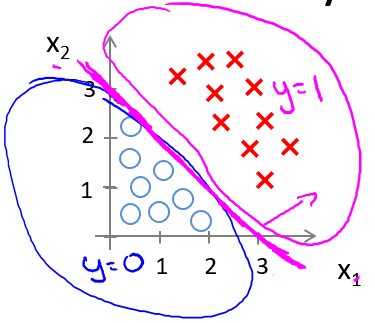
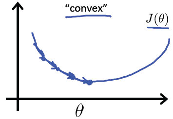
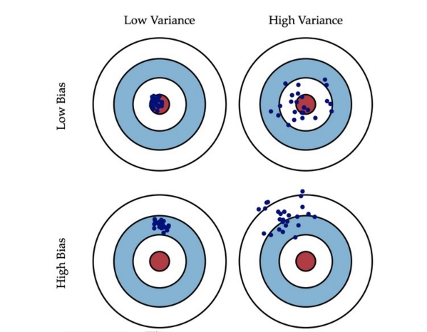
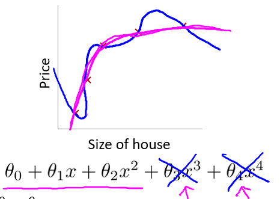

# 6 逻辑回归（Logistic Regression）

## 6.1 分类（Classification）

在分类问题中，预测的结果是离散值（结果是否属于某一类），逻辑回归算法（Logistic Regression）被用于解决这类分类问题。

- 垃圾邮件判断
- 金融欺诈判断
- 肿瘤诊断

讨论肿瘤诊断问题：


肿瘤诊断问题的目的是告诉病人**是否**为恶性肿瘤，是一个**二元分类问题（binary class problems）**，则定义 $ y \in\lbrace 0, 1\rbrace$，其中 0 表示**负向类（negative class）**，代表恶性肿瘤（"-"），1 为**正向类（positive class）**，代表良性肿瘤（"+"）。如图，定义最右边的样本为**偏差项**。

在未加入偏差项时，线性回归算法给出了品红色的拟合直线，若规定

$h_\theta(x) \geqslant 0.5$ ，预测为 $y = 1$，即正向类；

$h_\theta(x) \lt 0.5$ ，预测为 $y = 0$，即负向类。

即以 0.5 为**阈值（threshold）**，则我们就可以根据线性回归结果，得到相对正确的分类结果 $y$。


接下来加入偏差项，线性回归算法给出了靛青色的拟合直线，如果阈值仍然为 0.5，可以看到算法在某些情况下会给出完全错误的结果，对于癌症、肿瘤诊断这类要求预测极其精确的问题，这种情况是无法容忍的。

不仅如此，线性回归算法的值域为全体实数集（$h_\theta(x) \in R$），则当线性回归函数给出诸如 $h_\theta(x) = 10000, h_\theta(x) = -10000$ 等很大/很小（负数）的数值时，结果 $y \in \lbrace 0, 1\rbrace$，这显得非常怪异。


区别于线性回归算法，逻辑回归算法是一个分类算法，**其输出值永远在 0 到 1 之间**，即 $h_\theta(x) \in (0,1)$。

## 6.2 假设函数表示（Hypothesis Representation

为了使 $h_\theta(x) \in \left(0, 1\right)$，引入逻辑回归模型，定义假设函数
$$
h_\theta \left( x \right)=g(z)=g\left(\theta^{T}x \right)
$$
对比线性回归函数 $h_\theta \left( x \right)=\theta^{T}x$，$g$ 表示逻辑函数（[logistic function][1]），复合起来，则称为逻辑回归函数。

逻辑函数是 S 形函数，会将所有实数映射到 $(0, 1)$ 范围。

[sigmoid 函数][2]（如下图）是逻辑函数的特殊情况，其公式为 $g\left( z \right)=\frac{1}{1+{{e}^{-z}}}$。 


应用 sigmoid 函数，则逻辑回归模型：$$h_{\theta}(x)=g(\theta^Tx) =\frac{1}{1+e^{-\theta^Tx}}$$

逻辑回归模型中，$h_\theta \left( x \right)$ 的作用是，根据输入 $x$ 以及参数 $\theta$，计算得出”输出 $y=1$“的可能性（estimated probability），概率学中表示为：

$$
\begin{align*}
& h_\theta(x) = P(y=1 | x ; \theta) = 1 - P(y=0 | x ; \theta) \\
& P(y = 0 | x;\theta) + P(y = 1 | x ; \theta) = 1
\end{align*}
$$
以肿瘤诊断为例，$h_\theta \left( x \right)=0.7$ 表示病人有 $70\%$ 的概率得了恶性肿瘤。

[1]: https://en.wikipedia.org/wiki/Logistic_function
[2]: https://en.wikipedia.org/wiki/Sigmoid_function

## 6.3 决策边界（Decision Boundary）

决策边界的概念，可帮助我们更好地理解逻辑回归模型的拟合原理。

在逻辑回归中，有假设函数 $h_\theta \left( x \right)=g(z)=g\left(\theta^{T}x \right)$。

为了得出分类的结果，这里和前面一样，规定以 $0.5$ 为阈值：

$$
\begin{align*}
& h_\theta(x) \geq 0.5 \rightarrow y = 1 \\
& h_\theta(x) < 0.5 \rightarrow y = 0 \\
\end{align*}
$$
回忆一下 sigmoid 函数的图像：


观察可得当 $g(z) \geq 0.5$ 时，有 $z \geq 0$，即 $\theta^Tx \geq 0$。

同线性回归模型的不同点在于： 
$$
\begin{align*}
z \to +\infty, e^{-\infty} \to 0 \Rightarrow g(z)=1 \\
z \to -\infty, e^{\infty}\to \infty \Rightarrow g(z)=0
\end{align*}
$$
直观一点来个例子，${h_\theta}\left( x \right)=g\left( {\theta_0}+{\theta_1}{x_1}+{\theta_{2}}{x_{2}}\right)$ 是下图模型的假设函数：



根据上面的讨论，要进行分类，那么只要 $ {\theta_0}+{\theta_1}{x_1}+{\theta_{2}}{x_{2}}\geq0$ 时，就预测 $y = 1$，即预测为正向类。

如果取 $\theta = \begin{bmatrix} -3\\1\\1\end{bmatrix}$，则有 $z = -3+{x_1}+{x_2}$，当 $z \geq 0$ 即 ${x_1}+{x_2} \geq 3$ 时，易绘制图中的品红色直线即**决策边界**，为正向类（以红叉标注的数据）给出 $y=1$ 的分类预测结果。


上面讨论了逻辑回归模型中线性拟合的例子，下面则是一个多项式拟合的例子，和线性回归中的情况也是类似的。

为了拟合下图数据，建模多项式假设函数：

$$
{h_\theta}\left( x \right)=g\left( {\theta_0}+{\theta_1}{x_1}+{\theta_{2}}{x_{2}}+{\theta_{3}}x_{1}^{2}+{\theta_{4}}x_{2}^{2} \right)
$$
这里取 $\theta = \begin{bmatrix} -1\\0\\0\\1\\1\end{bmatrix}$，决策边界对应了一个在原点处的单位圆（${x_1}^2+{x_2}^2 = 1$），如此便可给出分类结果，如图中品红色曲线：


当然，通过一些更为复杂的多项式，还能拟合那些图像显得非常怪异的数据，使得决策边界形似碗状、爱心状等等。


简单来说，决策边界就是**分类的分界线**，分类现在实际就由 $z$ （中的 $\theta$）决定啦。

## 6.4 代价函数（Cost Function）

那我们怎么知道决策边界是啥样？$\theta$ 多少时能很好的拟合数据？当然，见招拆招，总要来个 $J(\theta)$。

如果直接套用线性回归的代价函数： $J\left( {\theta} \right)=\frac{1}{2m}\sum\limits_{i=1}^{m}{{{\left( h_{\theta} \left({x}^{\left( i \right)} \right)-{y}^{\left( i \right)} \right)}^{2}}}$

其中 $h_\theta(x) = g\left(\theta^{T}x \right)$，可绘制关于 $J(\theta)$ 的图像，如下图


回忆线性回归中的平方损失函数，其是一个二次凸函数（碗状），二次凸函数的重要性质是只有一个局部最小点即全局最小点。上图中有许多局部最小点，这样将使得梯度下降算法无法确定收敛点是全局最优。



如果此处的损失函数也是一个凸函数，是否也有同样的性质，从而最优化？这类讨论凸函数最优值的问题，被称为**凸优化问题（Convex optimization）**。

当然，损失函数不止平方损失函数一种。

对于逻辑回归，更换平方损失函数为**对数损失函数**，可由统计学中的最大似然估计方法推出代价函数 $J(\theta)$：

$$
\begin{align*}
& J(\theta) = \dfrac{1}{m} \sum_{i=1}^m \mathrm{Cost}(h_\theta(x^{(i)}),y^{(i)}) \\
& \mathrm{Cost}(h_\theta(x),y) = -\log(h_\theta(x)) \; & \text{if y = 1} \\
& \mathrm{Cost}(h_\theta(x),y) = -\log(1-h_\theta(x)) \; & \text{if y = 0}
\end{align*}
$$
则有关于 $J(\theta)$ 的图像如下：


如左图，当训练集的结果为 $y=1$（正样本）时，随着假设函数趋向于 $1$，代价函数的值会趋于 $0$，即意味着拟合程度很好。如果假设函数此时趋于 $0$，则会给出一个**很高的代价**，拟合程度**差**，算法会根据其迅速纠正 $\theta$ 值，右图 $y=0$ 同理。

区别于平方损失函数，对数损失函数也是一个凸函数，但没有局部最优值。

## 6.5 简化的成本函数和梯度下降（Simplified Cost Function and Gradient Descent）

由于懒得分类讨论，对于二元分类问题，我们可把代价函数**简化**为一个函数： 
$Cost\left( {h_\theta}\left( x \right),y \right)=-y\times log\left( {h_\theta}\left( x \right) \right)-(1-y)\times log\left( 1-{h_\theta}\left( x \right) \right)$

当 $y = 0$，左边式子整体为 $0$，当 $y = 1$，则 $1-y=0$，右边式子整体为0，也就和上面的分段函数一样了，而一个式子计算起来更方便。

$J(\theta) = - \frac{1}{m} \displaystyle \sum_{i=1}^m [y^{(i)}\log (h_\theta (x^{(i)})) + (1 - y^{(i)})\log (1 - h_\theta(x^{(i)}))]$

向量化实现：

$h = g(X\theta)$，$J(\theta) = \frac{1}{m} \cdot \left(-y^{T}\log(h)-(1-y)^{T}\log(1-h)\right)$


为了最优化 $\theta$，仍使用梯度下降法，算法同线性回归中一致：

$$
\begin{align*}
& \text{Repeat until convergence:} \; \lbrace \\
&{{\theta }_{j}}:={{\theta }_{j}}-\alpha \frac{\partial }{\partial {{\theta }_{j}}}J\left( {\theta}  \right) \\
\rbrace
\end{align*}
$$


解出偏导得：

$$
\begin{align*}
& \text{Repeat until convergence:} \; \lbrace \\
& \theta_j := \theta_j - \alpha \frac{1}{m} \sum\limits_{i=1}^{m} (h_\theta(x^{(i)}) - y^{(i)}) \cdot x_j^{(i)} \; & \text{for j := 0,1...n}\\
\rbrace
\end{align*}
$$


注意，虽然形式上梯度下降算法同线性回归一样，但其中的假设函不同，即$h_\theta(x) = g\left(\theta^{T}x \right)$，不过求导后的结果也相同。

向量化实现：$\theta := \theta - \frac{\alpha}{m} X^{T} (g(X \theta ) - y)$


**逻辑回归中代价函数求导的推导过程：**
$$
J(\theta) = - \frac{1}{m} \displaystyle \sum_{i=1}^m [y^{(i)}\log (h_\theta (x^{(i)})) + (1 - y^{(i)})\log (1 - h_\theta(x^{(i)}))]
$$
令 $f(\theta) = {{y}^{(i)}}\log \left( {h_\theta}\left( {{x}^{(i)}} \right) \right)+\left( 1-{{y}^{(i)}} \right)\log \left( 1-{h_\theta}\left( {{x}^{(i)}} \right) \right)$

忆及 $h_\theta(x) = g(z)$，$g(z) = \frac{1}{1+e^{(-z)}}$，则

$$
\begin{align*}
f(\theta) &= {{y}^{(i)}}\log \left( \frac{1}{1+{{e}^{-z}}} \right)+\left( 1-{{y}^{(i)}} \right)\log \left( 1-\frac{1}{1+{{e}^{-z}}} \right) \\
&= -{{y}^{(i)}}\log \left( 1+{{e}^{-z}} \right)-\left( 1-{{y}^{(i)}} \right)\log \left( 1+{{e}^{z}} \right)
\end{align*}
$$

忆及 $z=\theta^Tx^{(i)}$，对 $\theta_j$ 求偏导，则没有 $\theta_j$ 的项求偏导即为 $0$，都消去，则得：

$$
\frac{\partial z}{\partial {\theta_{j}}}=\frac{\partial }{\partial {\theta_{j}}}\left( \theta^Tx^{(i)}  \right)=x^{(i)}_j
$$
所以有：

$$
\begin{align*}
\frac{\partial }{\partial {\theta_{j}}}f\left( \theta  \right)&=\frac{\partial }{\partial {\theta_{j}}}[-{{y}^{(i)}}\log \left( 1+{{e}^{-z}} \right)-\left( 1-{{y}^{(i)}} \right)\log \left( 1+{{e}^{z}} \right)] \\
&=-{{y}^{(i)}}\frac{\frac{\partial }{\partial {\theta_{j}}}\left(-z \right) e^{-z}}{1+e^{-z}}-\left( 1-{{y}^{(i)}} \right)\frac{\frac{\partial }{\partial {\theta_{j}}}\left(z \right){e^{z}}}{1+e^{z}} \\
&=-{{y}^{(i)}}\frac{-x^{(i)}_je^{-z}}{1+e^{-z}}-\left( 1-{{y}^{(i)}} \right)\frac{x^{(i)}_j}{1+e^{-z}} \\
&=\left({{y}^{(i)}}\frac{e^{-z}}{1+e^{-z}}-\left( 1-{{y}^{(i)}} \right)\frac{1}{1+e^{-z}}\right)x^{(i)}_j \\
&=\left({{y}^{(i)}}\frac{e^{-z}}{1+e^{-z}}-\left( 1-{{y}^{(i)}} \right)\frac{1}{1+e^{-z}}\right)x^{(i)}_j \\
&=\left(\frac{{{y}^{(i)}}(e^{-z}+1)-1}{1+e^{-z}}\right)x^{(i)}_j \\
&={({{y}^{(i)}}-\frac{1}{1+{{e}^{-z}}})x_j^{(i)}} \\
&={\left({{y}^{(i)}}-{h_\theta}\left( {{x}^{(i)}} \right)\right)x_j^{(i)}} \\
&=-{\left({h_\theta}\left( {{x}^{(i)}} \right)-{{y}^{(i)}}\right)x_j^{(i)}}
\end{align*}
$$

则可得代价函数的导数：

$$
\frac{\partial }{\partial {\theta_{j}}}J(\theta) = -\frac{1}{m}\sum\limits_{i=1}^{m}{\frac{\partial }{\partial {\theta_{j}}}f(\theta)}=\frac{1}{m} \sum\limits_{i=1}^{m} (h_\theta(x^{(i)}) - y^{(i)}) \cdot x_j^{(i)}
$$


## 6.6 进阶优化（Advanced Optimization）

运行梯度下降算法，其能最小化代价函数 $J(\theta)$ 并得出 $\theta$ 的最优值，在使用梯度下降算法时，如果不需要观察代价函数的收敛情况，则直接计算 $J(\theta)$ 的导数项即可，而不需要计算 $J(\theta)$ 值。

我们编写代码给出代价函数及其偏导数然后传入梯度下降算法中，接下来算法则会为我们最小化代价函数给出参数的最优解。这类算法被称为**最优化算法（Optimization Algorithms）**，梯度下降算法不是唯一的最小化算法[^1]。

一些最优化算法：
- 梯度下降法（Gradient Descent）
- 共轭梯度算法（Conjugate gradient）
- 牛顿法和拟牛顿法（Newton's method & Quasi-Newton Methods）
  - DFP算法
  - 局部优化法（BFGS）
  - 有限内存局部优化法（L-BFGS）
- 拉格朗日乘数法（Lagrange multiplier）

比较梯度下降算法：一些最优化算法虽然会更为复杂，难以调试，自行实现又困难重重，开源库又效率也不一，哎，做个调包侠还得碰运气。不过这些算法通常效率更高，并无需选择学习速率 $\alpha$（少一个参数少一份痛苦啊！）。

Octave/Matlab 中对这类高级算法做了封装，易于调用。


假设有 $J(\theta) = (\theta_1-5)^2 + (\theta_2-5)^2$，要求参数 $\theta=\begin{bmatrix} \theta_1\\\theta_2\end{bmatrix}$的最优值。

下面为 Octave/Matlab 求解最优化问题的代码实例：

1. 创建一个函数以返回代价函数及其偏导数：

```matlab
function [jVal, gradient] = costFunction(theta)
  % code to compute J(theta)
  jVal=(theta(1)-5)^2+(theta(2)-5)^2;

  % code to compute derivative of J(theta)
  gradient=zeros(2,1);
  
  gradient(1)=2*(theta(1)-5);
  gradient(2)=2*(theta(2)-5);
end
```

2. 将 `costFunction` 函数及所需参数传入最优化函数 `fminunc`，以求解最优化问题：

```matlab
options = optimset('GradObj', 'on', 'MaxIter', 100);
initialTheta = zeros(2,1);
   [optTheta, functionVal, exitFlag] = fminunc(@costFunction, initialTheta, options);
```

> `'GradObj', 'on'`: 启用梯度目标参数（则需要将梯度传入算法）
>
> `'MaxIter', 100`: 最大迭代次数为 100 次
>
> `@xxx`: Octave/Matlab 中的函数指针
>
> `optTheta`: 最优化得到的参数向量
>
> `functionVal`: 引用函数最后一次的返回值
>
> `exitFlag`: 标记代价函数是否收敛

注：Octave/Matlab 中可以使用 `help fminunc` 命令随时查看函数的帮助文档。

3. 返回结果

```
optTheta =

     5
     5

functionVal = 0

exitFlag = 1
```

## 6.7 多类别分类: 一对多（Multiclass Classification: One-vs-all）

一直在讨论二元分类问题，这里谈谈多类别分类问题（比如天气预报）。


原理是，转化多类别分类问题为**多个二元分类问题**，这种方法被称为 One-vs-all。

正式定义：$h_\theta^{\left( i \right)}\left( x \right)=p\left( y=i|x;\theta  \right), i=\left( 1,2,3....k \right)$

> $h_\theta^{\left( i \right)}\left( x \right)$: 输出 $y=i$（属于第 $i$ 个分类）的可能性
>
> $k$: 类别总数，如上图 $k=3$。

注意多类别分类问题中 $h_\theta(x)$ 的结果不再只是一个实数而是一个向量，如果类别总数为 $k$，现在 $h_\theta(x)$ 就是一个 $k$ 维向量。

对于某个样本实例，需计算所有的 $k$ 种分类情况得到 $h_\theta(x)$，然后看分为哪个类别时预测输出的值最大，就说它输出属于哪个类别，即 $y = \mathop{\max}\limits_i\,h_\theta^{\left( i \right)}\left( x \right)$。

# 7 正则化（Regularization）
## 7.1 过拟合问题（The Problem of Overfitting）

对于拟合的表现，可以分为三类情况：
- **欠拟合（Underfitting）**

  无法很好的拟合训练集中的数据，预测值和实际值的误差很大，这类情况被称为欠拟合。拟合模型比较简单（特征选少了）时易出现这类情况。类似于，你上课不好好听，啥都不会，下课也差不多啥都不会。

- **优良的拟合（Just right）**

  不论是训练集数据还是不在训练集中的预测数据，都能给出较为正确的结果。类似于，学霸学神！

- **过拟合（Overfitting）**

  能很好甚至完美拟合训练集中的数据，即 $J(\theta) \to 0$，但是对于不在训练集中的**新数据**，预测值和实际值的误差会很大，**泛化能力弱**，这类情况被称为过拟合。拟合模型过于复杂（特征选多了）时易出现这类情况。类似于，你上课跟着老师做题都会都听懂了，下课遇到新题就懵了不会拓展。

线性模型中的拟合情况（左图欠拟合，右图过拟合）：


逻辑分类模型中的拟合情况：


为了度量拟合表现，引入：

- 偏差（bias）

  指模型的预测值与真实值的**偏离程度**。偏差越大，预测值偏离真实值越厉害。偏差低意味着能较好地反应训练集中的数据情况。

- 方差（Variance）

  指模型预测值的**离散程度或者变化范围**。方差越大，数据的分布越分散，函数波动越大，泛化能力越差。方差低意味着拟合曲线的稳定性高，波动小。

据此，我们有对同一数据的各类拟合情况如下图：


据上图，高偏差意味着欠拟合，高方差意味着过拟合。

我们应尽量使得拟合模型处于低方差（较好地拟合数据）状态且同时处于低偏差（较好地预测新值）的状态。

避免过拟合的方法有：

- 减少特征的数量
  - 手动选取需保留的特征
  - 使用模型选择算法来选取合适的特征（如 PCA 算法）
  - 减少特征的方式易丢失有用的特征信息
- 正则化（Regularization）
  - 可保留所有参数（许多有用的特征都能轻微影响结果）
  - 减少/惩罚各参数大小（magnitude），以减轻各参数对模型的影响程度
  - 当有很多参数对于模型只有轻微影响时，正则化方法的表现很好

## 7.2 代价函数（Cost Function）

很多时候由于特征数量过多，过拟合时我们很难选出要保留的特征，这时候应用正则化方法则是很好的选择。

上文中，$\theta_0 + \theta_1x + \theta_2x^2 + \theta_3x^3 + \theta_4x^4$ 这样一个复杂的多项式较易过拟合，在不减少特征的情况下，**如果能消除类似于 $\theta_3x^3$、$\theta_4x^4$ 等复杂部分，那复杂函数就变得简单了**。

为了保留各个参数的信息，不修改假设函数，改而修改代价函数：

$$
min_\theta\ \dfrac{1}{2m}\sum_{i=1}^m (h_\theta(x^{(i)}) - y^{(i)})^2 + 1000\cdot\theta_3^2 + 1000\cdot\theta_4^2
$$


上式中，我们在代价函数中增加了 $\theta_3$、$\theta_4$ 的惩罚项（penalty term）$1000\cdot\theta_3^2 + 1000\cdot\theta_4^2$，如果要最小化代价函数，那么势必需要极大地**减小 $\theta_3$、$\theta_4$**，从而使得假设函数中的 $\theta_3x^3$、$\theta_4x^4$ 这两项的参数非常小，就相当于没有了，假设函数也就**“变得”简单**了，从而在保留各参数的情况下避免了过拟合问题。




根据上面的讨论，有时也无法决定要减少哪个参数，故统一惩罚除了 $\theta_0$ 外的所有参数。

代价函数：

$$
J\left( \theta  \right)=\frac{1}{2m}[\sum\limits_{i=1}^{m}{{{({h_\theta}({{x}^{(i)}})-{{y}^{(i)}})}^{2}}+\lambda \sum\limits_{j=1}^{n}{\theta_{j}^{2}}]}
$$


> $\lambda$: 正则化参数（Regularization Parameter），$\lambda > 0$
>
> $\sum\limits_{j=1}^{n}$: 不惩罚基础参数 $\theta_0$
>
> $\lambda \sum\limits_{j=1}^{n}{\theta_{j}^{2}}$: 正则化项

$\lambda$ 正则化参数类似于学习速率，也需要我们自行对其选择一个合适的值。

- 过大
  - 导致模型欠拟合（假设可能会变成近乎 $x = \theta_0$ 的直线）
  - 无法正常去过拟问题
  - 梯度下降可能无法收敛
- 过小
  - 无法避免过拟合（等于没有）


> 正则化符合奥卡姆剃刀（Occam's razor）原理。在所有可能选择的模型中，能够很好地解释已知数据并且十分简单才是最好的模型，也就是应该选择的模型。从贝叶斯估计的角度来看，正则化项对应于模型的先验概率。可以假设复杂的模型有较大的先验概率，简单的模型有较小的先验概率。

> 正则化是结构风险最小化策略的实现，是去过拟合问题的典型方法，虽然看起来多了个一参数多了一重麻烦，后文会介绍自动选取正则化参数的方法。模型越复杂，正则化参数值就越大。比如，正则化项可以是模型参数向量的范数。

## 7.3 线性回归正则化（Regularized Linear Regression）

应用正则化的线性回归梯度下降算法：

$$
\begin{align*}
& \text{Repeat}\ \lbrace \\
& \ \ \ \ \theta_0 := \theta_0 - \alpha\ \frac{1}{m}\ \sum_{i=1}^m (h_\theta(x^{(i)}) - y^{(i)})x_0^{(i)} \\
& \ \ \ \ \theta_j := \theta_j - \alpha\ \left[ \left( \frac{1}{m}\ \sum_{i=1}^m (h_\theta(x^{(i)}) - y^{(i)})x_j^{(i)} \right) + \frac{\lambda}{m}\theta_j \right], \ \ \ j \in \lbrace 1,2...n\rbrace\\
& \rbrace
\end{align*}
$$
也可以移项得到更新表达式的另一种表示形式

$$
\theta_j := \theta_j(1 - \alpha\frac{\lambda}{m}) - \alpha\frac{1}{m}\sum_{i=1}^m(h_\theta(x^{(i)}) - y^{(i)})x_j^{(i)}
$$


> $\frac{\lambda}{m}\theta_j$: 正则化项


应用正则化的正规方程法[^2]：

$$
\begin{align*}
& \theta = \left( X^TX + \lambda \cdot L \right)^{-1} X^Ty \\
& \text{where}\ \ L = \begin{bmatrix} 0 & & & & \\
& 1 & & & \\
& & 1 & & \\
& & & \ddots & \\
& & & & 1 \\ \end{bmatrix}
\end{align*}
$$


> $\lambda\cdot L$: 正则化项
>
> $L$: 第一行第一列为 $0$ 的 $n+1$ 维单位矩阵

Octave 代码：
```matlab
>> L = eye(5)
>> L(1,1) = 0

L =

     0     0     0     0     0
     0     1     0     0     0
     0     0     1     0     0
     0     0     0     1     0
     0     0     0     0     1
```


前文提到正则化可以解决正规方程法中不可逆的问题，即增加了 $\lambda \cdot L$ 正则化项后，可以保证 $X^TX + \lambda \cdot L$ 可逆（invertible），即便 $X^TX$ 不可逆（non-invertible）。 

## 7.4 逻辑回归正则化（Regularized Logistic Regression）

为逻辑回归的代价函数添加正则化项：

$$
J(\theta) = - \frac{1}{m} \sum_{i=1}^m \large[ y^{(i)}\ \log (h_\theta (x^{(i)})) + (1 - y^{(i)})\ \log (1 - h_\theta(x^{(i)}))\large] + \frac{\lambda}{2m}\sum_{j=1}^n \theta_j^2
$$
前文已经证明过逻辑回归和线性回归的代价函数的求导结果是一样的，此处通过给正则化项添加常数 $\frac{1}{2}$，则其求导结果也就一样了。

从而有应用正则化的逻辑回归梯度下降算法：

$$
\begin{align*}
& \text{Repeat}\ \lbrace \\
& \ \ \ \ \theta_0 := \theta_0 - \alpha\ \frac{1}{m}\ \sum_{i=1}^m (h_\theta(x^{(i)}) - y^{(i)})x_0^{(i)} \\
& \ \ \ \ \theta_j := \theta_j - \alpha\ \left[ \left( \frac{1}{m}\ \sum_{i=1}^m (h_\theta(x^{(i)}) - y^{(i)})x_j^{(i)} \right) + \frac{\lambda}{m}\theta_j \right], \ \ \ j \in \lbrace 1,2...n\rbrace\\
& \rbrace \end{align*}
$$


[^1]: https://en.wikipedia.org/wiki/List_of_algorithms#Optimization_algorithms
[^2]: week2 - 4.6