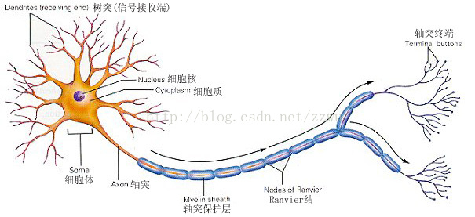
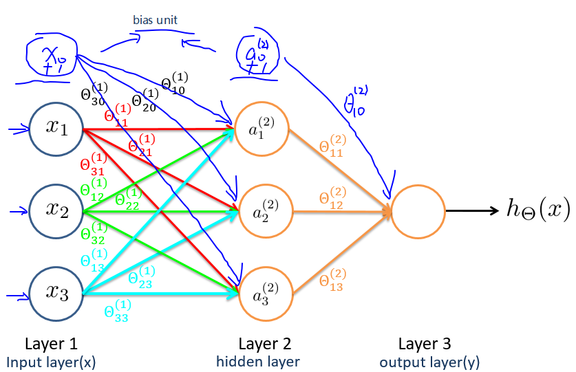

[TOC]

# 8 神经网络：表达(Neural Networks: Representation)

## 8.1 非线性假设(Non-linear Hypotheses)

理论上我们可以用多项式函数去近似任意函数，从而可得到任意问题的拟合曲线，即泰勒极数(Taylor series)。

在实际处理时，特征量通常会很多，如果再构造高阶多项式等，特征数量将会急剧增加，这使得线性模型的复杂度太高，可见并不合适。神经网络无需构造高阶多项式，在特征量很大时也可以处理的很好。

那特征能有多大呢？下面是一个计算机视觉中的例子：

如上图，如果选取一小块 $50 * 50$ 像素的灰度图片（一个像素只有亮度一个值），选择每个像素点作为特征，则特征总量 $n=2500$（换成 RGB（一个像素有三个值），则 $n = 7500$），如果将其两两组合作为新特征，则特征数量将为 $C_{2500}^{2} \approx 3\ million$。

## 8.2 神经网络和大脑(Neurons and the Brain)

脑科学家通过对动物实验，发现大脑中专用于处理听觉信号的脑皮层也能处理其他诸如视觉等信号，即如果切断其与耳朵的联系，将其与眼睛相连，则这块负责听觉的脑皮层区域也能接受并处理视觉信号，从而学会“看”。脑科学家通过这类换源实验，就推论假设大脑的学习算法只有一种(“one learning algorithm” hypothesis)。那么如果能找出这种学习算法并应用于计算机中，那梦想中和人一样的人工智能就成真了。

神经网络就源于**模拟人类大脑**，但其需要的计算量很大。随着计算机硬件性能的提高，神经网络逐渐从衰落变为流行，如今已广泛地被应用在各行各业中。

下图是根据研究做的一些应用（有兴趣可回顾视频）：

BrainPort  系统：帮助失明人士通过摄像头以及舌尖感官“看”东西

触觉皮带：在朝北时蜂鸣器会发出声响，可使人拥有方向感（声音信号转换为方向信号）。

## 8.3 模型表示1(Model Representation I)

既然神经网络模仿的是大脑神经元，那就先看一下大脑的神经元长什么样吧：

想象一下印刷厂中流水线的工人（机器人也算哦），每个工人都有特定的任务，比如装订，塑封，贴防伪标识等等，工人们看到书本并处理完自己的任务后，就回放回传送带，紧接着传送带就传给下一个环节的工人，如此不断重复从而完成一个又一个环节，直到一本书印制完成。

那么类比一下，把上图中的**细胞核(nucleus)**类比成工人，**轴突(axon)**类比传送带，**树突(dendrite)**则比类比成工人的双眼。一个又一个细胞体，从树突接收需要处理的信息，对其进行处理后，再经由轴突通过电信号把处理完的信息传递出去，直到理解信息的内容。当然啦，我们大脑的实际上还要更为复杂，而且一个人的神经元数目就比地球上所有流水线的工人之和还要多呢~

人工神经网络中，树突对应**输入(input)**，细胞核对应**激活单元(activation unit)**，轴突对应**输出(output)**。

我们一般把神经网络划分为三部分（注意，不是只有三层！），即输入层(input layer)，隐藏层(hidden layer)和输出层(output layer)。

图中的一个圈表示神经网络中的一个激活单元，输入层对应输入单元，隐藏层对应中间单元，输出层则对应输出单元。中间激活单元应用**激活函数**([activation_function](https://en.wikipedia.org/wiki/Activation_function))处理数据。

下面列出一些已有概念在神经网络中的别称：

- $x_0$: 偏置单元(bias unit)，$x_0$=1
- $\theta$: 权重(weight)，即参数。
- 激活函数: $g​$，即逻辑函数等。
- 输入层: 对应于训练集中的特征 $x$。
- 输出层: 对应于训练集中的结果 $y$。

>$a^{(j)}_i$: 第 $j$ 层的第 $i$ 个激活单元
>
>$\Theta^{(j)}$: 从第 $j$ 层映射到第 $j+1$ 层时的权重矩阵。
>
>$\Theta^{(j)}_{v,u}$: 从第 $j$ 层的第 $u$ 个单元映射到第 $j+1$ 层的第 $v$ 个单元的权重

注意：

- 符号较多，记不住可随时回顾！
- **每个单元会作用于下一层的所有单元**（矩阵乘法运算）。
- 如果第 $j$ 层有 $s_j$ 个单元，第 $j+1$ 层有 $s_{j+1}$ 个单元，$\Theta^{(j)}$ 是一个 $s_{j+1} \times (s_j+1)$ 维的权重矩阵。即每一层的权重矩阵大小都是非固定的。
- 其中，$+1$ 来自于偏置单元，这样意味着输出层不包含偏置单元，输入层和隐藏层需要增加偏置单元。

依据本节所给模型，有：

$Size(\Theta^{(1)})=s_{j+1} \times (s_j + 1) = 3 \times 4$

$Size(\Theta^{(2)})=s_{j+1} \times (s_j + 1) = 1 \times 4$

## 8.4 模型表示2(Model Representation II)

> 神经网络中的符号较多，易乱，建议多看几遍多回顾。

对第 $1$ 层的所有激活单元应用激活函数，从而得到第 $2$ 层激活单元的值：

$\begin{align*} a_1^{(2)} = g(\Theta_{10}^{(1)}x_0 + \Theta_{11}^{(1)}x_1 + \Theta_{12}^{(1)}x_2 + \Theta_{13}^{(1)}x_3) \newline a_2^{(2)} = g(\Theta_{20}^{(1)}x_0 + \Theta_{21}^{(1)}x_1 + \Theta_{22}^{(1)}x_2 + \Theta_{23}^{(1)}x_3) \newline a_3^{(2)} = g(\Theta_{30}^{(1)}x_0 + \Theta_{31}^{(1)}x_1 + \Theta_{32}^{(1)}x_2 + \Theta_{33}^{(1)}x_3) \newline \end{align*}$

对第 $2$ 层的所有激活单元应用激活函数，从而得到输出：

$h_\Theta(x) = a_1^{(3)} = g(\Theta_{10}^{(2)}a_0^{(2)} + \Theta_{11}^{(2)}a_1^{(2)} + \Theta_{12}^{(2)}a_2^{(2)} + \Theta_{13}^{(2)}a_3^{(2)})$

上面的计算过程被称为**前向传播(Forward propagation)**，即从输入层开始，一层一层地向下计算并传递结果。

再回顾一下逻辑回归：

${h_\theta}\left( x \right)=g\left( {\theta_0}+{\theta_1}{x_1}+{\theta_{2}}{x_{2}}+{\theta_{3}}x_{1}^{2} \right)$

是不是除了符号表示，其他都完全一样？其实神经网络就好似回归模型，只不过输入变成了中间单元 $a_1^{(j)}, a_2^{(j)}, \dots, a_n^{(j)}$。中间单元从输入向量 $x$ 开始，下一层的每个单元对所有输入的信息通过最优化算法不断迭代计算，每个单元因为包含了前一层的所有单元值，那么每个单元都能依赖于权重与输入得出关于输入向量的更多信息，就好像是在给假设函数加多项式。

中间单元就好像是包含了更多信息的升级版输入参数，使用包含更多信息的中间单元，也能产生更好地预测。

**向量化实现**

定义 $a^{(1)}=x=\left[ \begin{matrix}x_0\\ x_1 \\ x_2 \\ x_3 \end{matrix} \right]$，$\Theta^{(1)}=\left[\begin{matrix}\Theta^{(1)}_{10}& \Theta^{(1)}_{11}& \Theta^{(1)}_{12}& \Theta^{(1)}_{13}\\ \Theta^{(1)}_{20}& \Theta^{(1)}_{21}& \Theta^{(1)}_{22}& \Theta^{(1)}_{23}\\ \Theta^{(1)}_{30}& \Theta^{(1)}_{31}& \Theta^{(1)}_{32} & \Theta^{(1)}_{33}\end{matrix}\right]$，

$\begin{align*}a_1^{(2)} = g(z_1^{(2)}) \newline a_2^{(2)} = g(z_2^{(2)}) \newline a_3^{(2)} = g(z_3^{(2)}) \newline \end{align*}$，$z^{(2)}=\left[ \begin{matrix}z_1^{(2)}\\ z_1^{(2)} \\ z_1^{(2)}\end{matrix} \right]$

则有 $a^{(2)}= g(\Theta^{(1)}a^{(1)})=g(z^{(2)})$

预测结果即 $h_\Theta(x) = a^{(3)} = g(\Theta^{(2)}a^{(2)}) = g(z^{(3)})$

即有 $z^{(j)}_i = \Theta^{(j-1)}_{i,0}a^{(j-1)}_{0}+ \Theta^{(j-1)}_{i,1}a^{(j-1)}_{1}+\dots+ \Theta^{(j-1)}_{i,n}a^{(j-1)}_{n}$，

 $z^{(j)} = \Theta^{(j-1)}a^{(j-1)}$，$a^{(j)} = g(z^{(j)})$，通过该式即可计算神经网络中每一层的值。

结果即 $h_\Theta(x) = a^{(j)} = g(\Theta^{(j-1)}a^{(j-1)}) = g(z^{(j)})$

扩展到所有样本实例：

${{z}^{\left( 2 \right)}}={{\Theta }^{\left( 1 \right)}} {{X}^{T}}$，这时 $z^{(2)}$ 是一个 $s_2 \times m$ 维向量。

> $m$: 训练集中的样本实例数量
>
> $s_2$: 第二层神经网络中激活单元的数量

当然，神经网络不仅限于三层，每层的激活单元数量也并不固定：

## 8.5 例子和直观理解1(Examples and Intuitions I)

## 8.6 例子和直观理解2(Examples and Intuitions II)

## 8.7 多类别分类(Multiclass Classification)